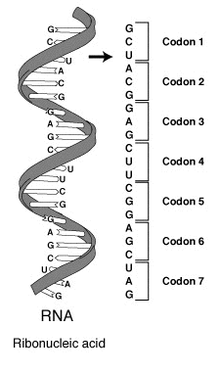
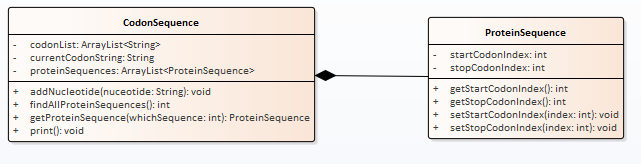

## Codon
The project name of this lab is Codon.

Purpose of this lab  

This lab is to introduce you to one of the components of genetic testing. In our cells we contain both [DNA](https://en.wikipedia.org/wiki/DNA) and [RNA](https://en.wikipedia.org/wiki/RNA) which are used to create (or encode) proteins which do a lot of the work in our bodies.

The information contained within RNA is made up of a series of chemicals called [nucleotides](https://en.wikipedia.org/wiki/Nucleotide) and those chemicals are abbreviated to four letters A ([adenine](https://en.wikipedia.org/wiki/Adenine), C ([cytosine](https://en.wikipedia.org/wiki/Cytosine)), U([uracil](https://en.wikipedia.org/wiki/Uracil)), and G ([guanine](https://en.wikipedia.org/wiki/Guanine)). When someone has their RNA sequenced then you get a sequence of these chemicals and it looks like this:

GUGUCGCGUGGGCAUUCGUAA

However, the nucleotides bunch up into groups of three called codons (Links to an external site.) and it is the codon analysis that gives us insight into the genetic structure. Since they are lumped into groups of three you can actually have three possible sequences (called frames) from a given stream of nucleotides.

If you start with the first nucleotide and group by threes you get

GUG UCG CGU GGG CAU UCG UAA

If you start with the second one (by skipping the first one) you get

[skip G] UGU CGC GUG GGC AUU CGU [skip AA]

and if you start with the third one (by skipping the first two) you get

[skip GU] GUC GCG UGG GCA UUC GUA [skip A]

Each one of these constitutes a sequence that must be examined to find a sequence that creates a protein (called a protein sequence). When looking at the codons there are special codons which indicate the start of a protein sequence and those codons, called start codons, are "AUG", "GUG", and "UUG". If we look at our sequences above then only the first group of codons actually contains a valid start codon; the other two do not. A sequence is terminated by one of the stop codons which are "UAA", "UAG", and "UGA". Note that there is only one start codon and one stop codon for a protein sequence. All of the codons in between make up the protein that will actually be created by the protein sequence.

**Design of the Software**    

The UML diagram below features the objects that you will create.

The Codon sequence is simply the nucletides grouped by threes and kept in the list called proteinSequences. This is created by adding one nucleotide at a time to our codon sequence using the method addNucleotide. You will have to take care of the grouping by three in your code. At any point you can figure out all of the protein sequences present by calling the findAllProteinSequences method which returns the number of protein sequences found. You can then extract any one of the ProteinSequences by giving an index. If the index is within the number of protein sequences found then the ProteinSequence object is returned. If the index is outside of the number of protein sequences found then a null is returned. The ProteinSequence object can be queried to find the starting codon and ending codon.

Note: Only your Program class should deal with reading the text file. It will at least do the printing of the number of sequences and the start and stop, but will delegate printing the list of sequences to the print method of the Codon class. 

**Testing the Software** 

You will write the code which tests your software in the Program.java source file. There is a test file (called testSequence.txt on Canvas) that you can use to test your code. Your code will open the file and load up the three CodonSequence objects (one per frame). You will then print out the results. This is what the result should look like when using the test file:

Number of Sequences: 0  
CGU  
GGA  
GGC  
CUA  
CCC  
ACU  
GUG  
ACG  
UGG  
AGG  
CCU  
ACC  
CAC  
UGU  

******

Number of Sequences: 1
Sequence: 1 Start Codon: 0 Stop Codon: 6  
GUG  
GAG  
GCC  
UAC  
CCA  
CUG  
UGA  
CGU  
GGA  
GGC  
CUA  
CCC  
ACU  
GUG  

******

Number of Sequences: 1
Sequence: 1 Start Codon: 7 Stop Codon: 13  
UGG  
AGG  
CCU  
ACC  
CAC  
UGU  
GAC  
GUG  
GAG  
GCC  
UAC  
CCA  
CUG  
UGA  

**UML Diagram for the Project**
No UML diagram is required for this project as I have provided one.

**Running the Unit Tests**

Next you'll want to run these unit tests. Start by right-clicking on the unittest.csv40 package and selecting Run As -> JUnit Test. 

To go back to the project view, select the Package Explorer tab.

**How to Submit this Exercise**

To go back to the project view, select the Package Explorer tab.

Review the [submission instructions](https://canvas.sbcc.edu/courses/25766/modules/items/735514).

Image credit: "RNA-codons (Links to an external site.)" by TransControl - http://en.wikipedia.org/skins-1.5/common/images/magnify-clip.png. Licensed under CC BY-SA 3.0 (Links to an external site.) via Wikimedia Commons (Links to an external site.).##
